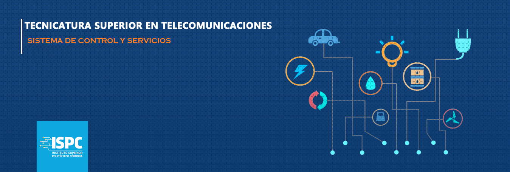

# Bienvenidos al Mono Repositorio de Ulises Ale  

### Sistemas de Control y Servicios - TST - 2024

- ✔️**Ulises Ale**.  [Ver Github](https://github.com/ulisesaale)

### Docente

- 👨‍🏫**Cristian Gonzalo Vera**. Prof. Instituto Superior Politécnico Córdoba y Desarrollador IoT. [Ver Github](https://github.com/Gona79).

